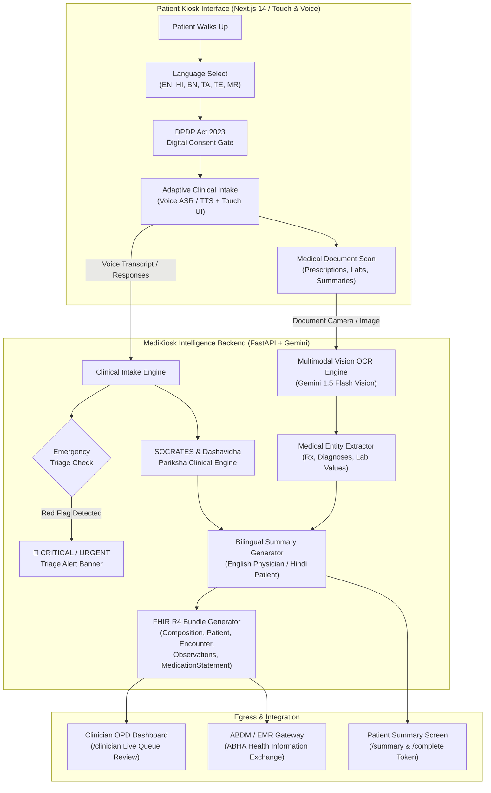

# MediKiosk (मेडीकियोस्क) — AI-Powered Patient Clinical Intake Kiosk

[](https://medikiosk-startupx.vercel.app/)
[](https://medikiosk-production-9938.up.railway.app)
[](https://medikiosk-production-9938.up.railway.app/docs)
[](https://opensource.org/licenses/MIT)
[](https://nrces.in/ndhm/fhir/r4/)
[](https://www.meity.gov.in/)

> **Problem Statement 26047** — Ministry of Ayush & All India Institute of Ayurveda (AIIA)  
> *An intelligent, multilingual, self-service patient clinical intake kiosk designed to eliminate OPD bottlenecks, digitize historical medical documents, conduct structured clinical interviews (SOCRATES + Dashavidha Pariksha), identify red-flag medical emergencies, and generate bilingual FHIR R4-compliant summaries for hospital EMRs via ABDM.*

---

## 🔗 Quick Links

| Resource | URL |
|---|---|
| **🌐 Live Application (Vercel)** | [https://medikiosk-startupx.vercel.app/](https://medikiosk-startupx.vercel.app/) |
| **🚀 Production Backend (Railway)** | [https://medikiosk-production-9938.up.railway.app](https://medikiosk-production-9938.up.railway.app) |
| **📚 Interactive Swagger API Docs** | [https://medikiosk-production-9938.up.railway.app/docs](https://medikiosk-production-9938.up.railway.app/docs) |
| **📁 GitHub Repository** | [https://github.com/Sohaam007/MediKiosk](https://github.com/Sohaam007/MediKiosk) |

---

## 🎥 Video Demonstration

<!-- DEMO_VIDEO_LINK_PLACEHOLDER -->
> **Watch the complete MediKiosk workflow demonstration:**
> 
> [](YOUR_DEMO_VIDEO_LINK_HERE)
> 
> *Direct Link:* [Demo Video Link — Coming Soon](YOUR_DEMO_VIDEO_LINK_HERE)  
> *(Update `YOUR_DEMO_VIDEO_LINK_HERE` with your YouTube, Loom, or Google Drive demonstration link).*

---

## 🏥 The Problem & Healthcare Challenge

In high-volume public hospitals, Ayurvedic institutions (such as AIIA), and tertiary care OPDs across India:
1. **The OPD Bottleneck:** Physicians spend **15–20 minutes per patient** manually taking medical history, typing complaints, and deciphering old handwritten papers. This creates long waiting lines and reduces actual diagnostic and counseling time to mere minutes.
2. **Language & Digital Divide:** Patients arrive from varied linguistic backgrounds and literacy levels. Traditional computer terminals or complex mobile apps fail where voice-first, native Indian language interfaces are needed.
3. **Disorganized Physical Records:** Patients bring crumpled plastic bags filled with previous handwritten prescriptions, disparate lab reports, and discharge summaries that clinicians cannot parse in a short consultation window.
4. **Dual-Medicine Integration:** Ayurvedic clinical diagnosis requires deep holistic evaluation (**Dashavidha Pariksha** & Prakriti assessment) alongside modern clinical history (**SOCRATES** framework). Standard systems only support one or the other.
5. **Data Silos & Privacy Mandates:** Clinical history collected at triage rarely syncs into national digital health highways (ABDM / Ayushman Bharat Digital Mission) or complies with India's **DPDP Act 2023** consent requirements.

---

## 💡 The Solution — MediKiosk

**MediKiosk** transforms patient intake from a manual 20-minute doctor interrogation into a **self-service 5-minute multimodal experience** at a hospital kiosk:

1. **Walk-up & Language Selection:** Patient chooses their preferred language (English, Hindi, Bengali, Tamil, Telugu, Marathi).
2. **DPDP Act Digital Consent:** Purpose-bound, transparent patient consent obtained with clear rights explanation.
3. **Voice & Touch Clinical Interview:** Adaptive AI dialog driven by Google Gemini 1.5, following standard clinical history protocols (**SOCRATES**) and Ayurvedic examination (**Dashavidha Pariksha**).
4. **Instant Red-Flag Emergency Triage:** Real-time screening for emergency conditions (ABCDE protocol) with instant audiovisual alerts for immediate resuscitation or ER redirection.
5. **Multimodal Document OCR & Entity Extraction:** Live camera capture or file upload for existing prescriptions and lab reports; extracts medications, dosages, past diagnoses, and lab values.
6. **Chronological Medical Timeline & Bilingual Summary:** Produces side-by-side English (for doctors) and Hindi (for patients) structured summaries with clinical coding.
7. **ABDM FHIR R4 Bundle Export:** Automatically packages intake into an HL7 FHIR R4 `OPConsultation` document bundle linked with the patient's ABHA ID ready for hospital EMR integration.
8. **Clinician OPD Dashboard:** Doctors can view their live OPD queue, review pre-consultation summaries in 30 seconds, verify extracted prescriptions, and export FHIR bundles.

---

## 🏗️ System Architecture & Workflow



---

## ✨ Key Features

### 1. Multilingual Voice & Touch Conversational Intake
- Supports **6 Indian languages**: English (`en`), Hindi (`hi`), Bengali (`bn`), Tamil (`ta`), Telugu (`te`), and Marathi (`mr`).
- Seamless speech-to-text (STT) voice recognition using the Web Speech API with real-time speech visualization.
- Natural text-to-speech (TTS) playback in native regional language accents for low-literacy accessibility.
- Intelligent single-choice and multi-choice touch fallback buttons for fast triage responses.

### 2. Dual Clinical Frameworks (Modern + Ayush)
- **SOCRATES Pain & Symptom Framework:** Evaluates **S**ite, **O**nset, **C**haracter, **R**adiation, **A**ssociations, **T**ime course, **E**xacerbating/relieving factors, and **S**everity (1–10).
- **Ayurvedic Dashavidha Pariksha:** Evaluates the tenfold Ayurvedic clinical diagnostic parameters: *Prakriti* (constitution), *Vikriti* (morbid diathesis), *Sara* (tissue quality), *Samhanana* (body build), *Pramana* (anthropometry), *Satmya* (habituation), *Sattva* (mental stamina), *Ahara-shakti* (digestive fire/Agni), *Vyayama-shakti* (physical endurance), and *Vaya* (age).

### 3. Real-Time Red-Flag Emergency Triage
- Continuous monitoring of patient statements against the **ABCDE protocol** (Airway, Breathing, Circulation, Disability, Exposure).
- Automatic detection of critical conditions: crushing chest pain radiating to left arm/jaw, acute dyspnea, stroke signs (facial droop, hemiparesis), severe unmanaged hemorrhage, anaphylaxis, or suicidal ideation.
- Renders an immediate, prominent **Red-Flag Banner**, triggers audio warnings, and prioritizes the patient in the clinician queue.

### 4. Multimodal Document OCR & Entity Extraction
- Built-in document camera interface and file uploader supporting prescriptions, diagnostic lab reports, and hospital discharge summaries.
- Powered by **Gemini 1.5 Flash Vision** with clinical prompt templates.
- Extracts structured medical entities:
  - **Medications:** Name, dosage, frequency, route, and duration.
  - **Diagnoses:** Chronic and acute conditions.
  - **Lab Values:** Test names, observed values, units, and reference ranges.
  - **Doctor Information:** Prescriber name, clinic/hospital, and dates.

### 5. DPDP Act 2023 Digital Consent Gate
- Strict consent-first architecture: no patient data is processed or transmitted without explicit patient authorization.
- Displays clear purpose specification (`clinical_intake` and `abdm_share`) in the patient's language.
- Generates cryptographically secure, timestamped consent IDs.
- Ephemeral in-memory session architecture preventing unintentional PHI leakage or persistent local caching.

### 6. Bilingual Clinical Summary & Timeline
- Generates a physician-ready clinical consultation brief alongside a patient-friendly translated version.
- Structured clinical sections: Chief Complaint, History of Present Illness (HPI), Past Medical & Surgical History, Current Medications, Document Summaries, Ayurvedic Parameters, and Triage Observations.

### 7. ABDM & FHIR R4 Compliant EMR Export
- Builds a complete, valid HL7 FHIR R4 **Document Bundle** (`bundle_json`) containing:
  - `Bundle` (type: `document`)
  - `Composition` (Clinical consultation summary with section narratives)
  - `Patient` (Linked with national ABHA ID identifier profile)
  - `Encounter` (Ambulatory consultation with clinical status)
  - `Observation` (Vitals, pain score, triage findings)
  - `MedicationStatement` (Active drugs extracted from prescriptions)
- Verified against the NRCES National Digital Health Mission (NDHM) profiles.

### 8. Clinician OPD Dashboard (`/clinician`)
- Real-time queue view of waiting patients with triage severity indicators (`CRITICAL`, `URGENT`, `NORMAL`).
- One-click expandable patient review showing bilingual summaries, extracted prescription items, and clinical history.
- Built-in JSON viewer and copy tool to inspect and export FHIR R4 bundles into hospital HIS/EMR systems.

---

## 🛠️ Tech Stack & Architecture

| Layer | Technologies Used |
|---|---|
| **Frontend Framework** | [Next.js 14](https://nextjs.org/) (App Router), React 18, TypeScript |
| **Styling & Icons** | [Tailwind CSS](https://tailwindcss.com/), `@tailwindcss/forms`, [Lucide React](https://lucide.dev/) |
| **Speech & Audio** | Web Speech API (SpeechRecognition + SpeechSynthesis) |
| **Backend Framework** | [FastAPI](https://fastapi.tiangolo.com/) (Python 3.11), [Pydantic v2](https://docs.pydantic.dev/), [Uvicorn](https://www.uvicorn.org/) |
| **AI / Multimodal LLM** | [Google Gemini 1.5 Flash](https://deepmind.google/technologies/gemini/) (`google-generativeai`) |
| **Document Vision** | Gemini Vision API + [Pillow](https://python-pillow.org/) Image Preprocessing |
| **Health Standards** | [HL7 FHIR R4](https://hl7.org/fhir/R4/), [ABDM (NDHM) India Profiles](https://nrces.in/ndhm/fhir/r4/), SNOMED CT |
| **Hosting & Deployment** | [Vercel](https://vercel.com) (Frontend), [Railway](https://railway.app) (Dockerized Backend) |
| **Testing & QA** | [Pytest](https://docs.pytest.org/), AnyIO, HTTPX TestClient |

---

## 📂 Repository Structure

```
medikiosk/
├── frontend/                     # Next.js 14 Patient & Clinician Web Application
│   ├── app/
│   │   ├── page.tsx              # Welcome & Language Selection Screen
│   │   ├── consent/page.tsx      # DPDP Act 2023 Digital Consent Screen
│   │   ├── intake/page.tsx       # Interactive Voice & Touch Intake Chat
│   │   ├── upload/page.tsx       # Document Camera & Image Upload (OCR)
│   │   ├── summary/page.tsx      # Bilingual Clinical Summary & Review
│   │   ├── complete/page.tsx     # Session Token & Check-In Completion
│   │   ├── clinician/page.tsx    # Clinician OPD Queue & FHIR Export Dashboard
│   │   └── layout.tsx            # Global Layout & Providers
│   ├── components/               # Modular UI Components (ChatMessage, VoiceButton, etc.)
│   ├── contexts/                 # React Contexts (LanguageContext, IntakeContext)
│   ├── hooks/                    # Custom Hooks (useVoiceInput, useTTS)
│   └── lib/api.ts                # Unified Backend API Client
├── backend/                      # FastAPI Python Backend Service
│   ├── intake/                   # Clinical Questioning Engine (Gemini + Fallbacks)
│   │   ├── engine.py             # SOCRATES & Dashavidha prompt logic & triage
│   │   └── router.py             # /api/intake endpoints
│   ├── ocr/                      # Medical Document Vision Processing
│   │   ├── processor.py          # Gemini Vision prompt & clinical entity parsing
│   │   └── router.py             # /api/ocr/process endpoint
│   ├── summary/                  # Clinical Summary Generator
│   │   ├── generator.py          # Bilingual summary generation engine
│   │   └── router.py             # /api/summary endpoints
│   ├── consent/                  # DPDP Consent Manager
│   │   └── router.py             # /api/consent/grant endpoint
│   ├── fhir/                     # ABDM FHIR R4 Bundle Builder
│   │   ├── generator.py          # FHIR Composition, Patient, Encounter builder
│   │   └── router.py             # /api/fhir/bundle endpoint
│   ├── tests/                    # Automated Test Suite (15 passing tests)
│   │   ├── test_api.py           # API integration tests
│   │   └── test_intake.py        # Triage and intake logic tests
│   ├── config.py                 # Environment configuration
│   ├── store.py                  # Ephemeral in-memory session repository
│   ├── Dockerfile                # Production Docker container
│   ├── railway.toml              # Railway deployment specification
│   └── main.py                   # FastAPI application entry point
├── core/                         # Pure algorithmic logic & frozen contracts
│   └── contracts/                # Standard domain contract definitions
├── docs/                         # Specification & Architecture Documentation
│   ├── ARCHITECTURE.md           # System design and boundary rules
│   ├── CONTRACTS.md              # Type definitions and data schemas
│   ├── ROADMAP.md                # Project roadmap and milestones
│   └── tasks/                    # Task specifications per domain
└── pyproject.toml                # Python package configuration
```

---

## 📡 API Reference

All backend endpoints are documented interactively via OpenAPI / Swagger at `/docs`.

| Method | Endpoint | Description | Request Payload | Response |
|---|---|---|---|---|
| `GET` | `/health` | Service health status | None | `{"status": "ok"}` |
| `POST` | `/api/consent/grant` | Grant digital consent under DPDP Act 2023 | `{"session_id", "purpose", "patient_confirmation"}` | `{"consent_id", "granted_at"}` |
| `POST` | `/api/intake/start` | Initialize intake session and fetch opening question | `{"language": "hi", "patient_name": "..."}` | `{"session_id", "first_question", "choices"}` |
| `POST` | `/api/intake/respond` | Submit patient response (voice/text) & get next question | `{"session_id", "response", "language"}` | `{"next_question", "progress", "triage_alert", "is_complete"}` |
| `POST` | `/api/ocr/process` | Upload document image for OCR & entity extraction | `multipart/form-data` (`file`, `session_id`) | `{"scan_id", "document_type", "extracted_text", "entities", "confidence"}` |
| `POST` | `/api/summary/generate` | Generate structured bilingual clinical summary | `{"session_id"}` | `{"summary_id", "sections": [...], "triage_alerts": [...]}` |
| `GET` | `/api/fhir/bundle` | Export ABDM FHIR R4 `OPConsultation` document bundle | `?session_id=...` | `{"bundle_json": {...}, "validation_passed": true}` |

---

## 🚀 Local Installation & Setup

### Prerequisites
- **Node.js** >= 18.0.0
- **Python** >= 3.10
- **Google Gemini API Key** (Get one at [Google AI Studio](https://aistudio.google.com/))
- **Git**

---

### 1. Clone the Repository
```bash
git clone https://github.com/Sohaam007/MediKiosk.git
cd MediKiosk
```

---

### 2. Backend Setup (FastAPI)

```bash
# Navigate to backend or root
cd backend

# Create and activate a virtual environment
python -m venv venv
# On Windows:
.\venv\Scripts\activate
# On Linux/macOS:
source venv/bin/activate

# Install dependencies
pip install -r requirements.txt

# Configure environment variables
cp .env.example .env
```

Edit `.env` to include your Google Gemini API key:
```env
GEMINI_API_KEY=AIzaSy...your_gemini_api_key_here
GEMINI_MODEL=gemini-1.5-flash
PORT=8000
DEBUG=true
```

Start the backend server:
```bash
uvicorn main:app --reload --host 0.0.0.0 --port 8000
```
The backend API is now running at `http://localhost:8000`.  
Swagger documentation is available at `http://localhost:8000/docs`.

---

### 3. Frontend Setup (Next.js 14)

Open a new terminal window:
```bash
cd frontend

# Install npm dependencies
npm install

# Configure environment variables
cp .env.example .env.local
```

Ensure `.env.local` points to your backend:
```env
# For local development:
NEXT_PUBLIC_API_URL=http://localhost:8000

# Or point to the live Railway backend:
# NEXT_PUBLIC_API_URL=https://medikiosk-production-9938.up.railway.app
```

Start the Next.js development server:
```bash
npm run dev
```

Open [http://localhost:3000](http://localhost:3000) in your browser.

---

### 4. Running Tests

Run the complete test suite verifying API routers, session storage, and clinical intake triage logic:
```bash
pytest backend/
```

Expected output:
```
======================== 15 passed in 1.52s ========================
```

---

## 🔒 Privacy, Security & DPDP Compliance

MediKiosk was engineered from day one around **patient privacy and data sovereignty**:
- **DPDP Act 2023 Compliant:** Patient consent is explicitly acquired, purpose-limited (`clinical_intake`), revocable, and audited.
- **Zero Persistent PHI Policy:** The kiosk operates with an ephemeral session model. Transcripts, images, and identifiable data are not stored in unencrypted persistent disk caches.
- **Strict Boundary Redaction:** Patient names, Aadhaar numbers, and raw identifiers are never written to server console logs, external tracking scripts, or error traces.
- **Hardware-Isolated Architecture:** Designed for deployment on local hospital Intranet/LAN, with secure reverse-proxy TLS termination.

---

## 🗺️ Roadmap & Next Milestones

- [x] Multilingual voice and touch UI across 6 Indian languages
- [x] SOCRATES clinical questioning and red-flag emergency triage
- [x] Ayurvedic Dashavidha Pariksha integration
- [x] Gemini 1.5 Flash Vision document OCR & medical entity extraction
- [x] Bilingual (English + Hindi) clinical summary generation
- [x] ABDM-compliant FHIR R4 `OPConsultation` document bundle generator
- [x] Clinician OPD queue review dashboard
- [ ] On-device offline SLM fallback (for rural PHCs with intermittent internet)
- [ ] Hardware kiosk enclosure CAD designs & thermal token printer driver
- [ ] Live bi-directional integration with ABDM M1, M2, and M3 milestone APIs
- [ ] Additional regional languages (Kannada, Malayalam, Gujarati, Odia, Punjabi)

---

## 👥 Contributors & Acknowledgments

Developed by **Team StartupX** for the Ministry of Ayush / All India Institute of Ayurveda (AIIA) Hackathon.

Special thanks to:
- **Ministry of Ayush & AIIA** for the problem statement and clinical domain guidance.
- **Google DeepMind / Google AI** for Gemini 1.5 Flash multimodal models.
- **National Health Authority (NHA)** for the ABDM FHIR R4 schema definitions and guidelines.

---

## 📄 License

This project is licensed under the [MIT License](LICENSE).
