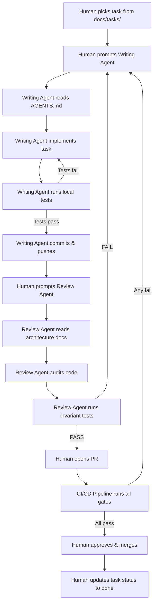

# AI-Orchestrated Software Development Lifecycle

## 1. The Problem: 2 Humans Building Enterprise Software

MediKiosk requires ~50,000+ lines of production code across backend, frontend, tests, and
infrastructure. A 2-person team cannot write, review, test, and maintain this manually.

AI agents (Antigravity, GitHub Copilot, Claude, Gemini) are the primary code generators.
But AI agents have dangerous failure modes: hallucination, security blindness, architectural
drift, context loss, and phantom types. Without a structured orchestration system, the
codebase **will** devolve into spaghetti code with critical security gaps.

## 2. The Three-Layer Safety Net

Every line of AI-generated code passes through three independent quality gates before
reaching `main`. No single gate is sufficient alone — they catch different failure modes.

### Layer 1: The Writing Agent (Code Generator)
The AI that writes the code.

**Rules for prompting a writing agent:**
1. Always start with: "Read AGENTS.md first."
2. Point to exactly ONE task ticket from docs/tasks/ (never multiple tasks per session)
3. Include the full task spec in the prompt (copy the Build section)
4. Explicitly state constraints: "Do not modify any file outside of [specific paths]"
5. Require the agent to run tests before declaring done

**Prompt template:**
```
You are working on MediKiosk. Read AGENTS.md first.

Your task is [TAG-N] from docs/tasks/[FILE].md.
Here is the full task spec:
[paste Build section]

Constraints:
- Only create/modify files in: [list exact paths]
- Run `uv run pytest tests/invariants/ -q` before declaring done
- Run `uv run mypy src/ --strict` before declaring done
- Do not modify any existing contract types
- Do not add dependencies to pyproject.toml without an ADR

Done when: [paste Done when criteria]
```

### Layer 2: The Review Agent (Architectural Auditor)
A SEPARATE AI agent session that reviews the writing agent's output.

**Rules for the review agent:**
1. NEVER the same session as the writing agent (prevents confirmation bias)
2. Must be prompted with: "You are a hostile code reviewer. Find every flaw."
3. Reviews against 5 checklists:
   - [ ] Clean architecture compliance (no import violations)
   - [ ] PHI safety (no patient data in logs, errors, or responses)
   - [ ] Contract consistency (new code uses existing contracts, doesn't create parallel types)
   - [ ] Test coverage (every public function has a test, every test has an assertion message)
   - [ ] Security (no SQL injection, no XSS, no secrets in code, no broad exception handling)
4. The review agent MUST run the invariant tests independently
5. The review agent produces a structured verdict: PASS / FAIL with specific line references

**Review prompt template:**
```
You are a hostile code reviewer for MediKiosk.
Read AGENTS.md, then docs/ARCHITECTURE.md, then docs/ENGINEERING.md, then docs/SECURITY.md.

Review the following changes for task [TAG-N]:
[paste git diff or list of modified files]

Check against:
1. Clean architecture (domain/ has no I/O, imports point inward)
2. PHI safety (no patient data in logs/errors/responses)
3. Contract consistency (uses existing types from domain/contracts/)
4. Test quality (every public function tested, assertion messages present)
5. Security (no injection, no XSS, no secrets, no broad exceptions)

Run: `uv run pytest tests/invariants/ -q`
Run: `uv run mypy src/ --strict`
Run: `uv run ruff check src/ tests/`

Output format:
## Verdict: PASS or FAIL
## Issues Found (if any):
- [file:line] Description of issue
## Architectural Invariant Test Results:
[paste output]
```

### Layer 3: The CI/CD Gatekeeper (Absolute Authority)
Automated pipeline that runs on every PR. No human or AI can bypass it.

**CI pipeline stages:**
```
Stage 1: Lint & Format
  └── ruff check src/ tests/
  └── ruff format --check src/ tests/

Stage 2: Type Safety
  └── mypy src/ --strict

Stage 3: Architectural Invariants
  └── pytest tests/invariants/ -q --tb=short

Stage 4: Unit Tests
  └── pytest tests/unit/ -q --tb=short --cov=src/medikiosk/domain --cov-fail-under=80

Stage 5: Security Scan
  └── pip-audit
  └── ruff check --select S src/   (bandit security rules)
  └── gitleaks detect --source .

Stage 6: Integration Tests (on merge to main only)
  └── pytest tests/integration/ -q --tb=short

Stage 7: SBOM & Artifact
  └── Generate Software Bill of Materials
  └── Build container image
  └── trivy image scan
```

**Merge rules:**
- ALL stages must pass (no exceptions, no manual overrides)
- At least 1 human approval required
- Branch must be up-to-date with main
- PR title must reference a task ticket

## 3. The AI Agent Workflow (Step by Step)

This is the exact workflow for completing one task from start to merge:



## 4. Anti-Patterns: How AI Agents Break Codebases

These are the 10 most common failure modes we've observed when AI agents generate code.
Each one has a concrete prevention mechanism built into our pipeline.

| # | Anti-Pattern | Example | Prevention |
|---|---|---|---|
| 1 | Scope creep | Agent asked to build OCR, also refactors intake engine | One ticket per session, explicit path constraints |
| 2 | Phantom types | Agent creates `OcrResult` instead of using existing `DocumentScan` | Review agent checks contract consistency |
| 3 | Test theater | Agent writes tests that always pass (no real assertions) | Review agent checks assertion messages |
| 4 | Import contamination | Agent imports `requests` in domain/ | Invariant test catches this |
| 5 | Secret leakage | Agent hardcodes API key in adapter | gitleaks in CI catches this |
| 6 | Broad exception swallowing | Agent uses `except Exception: pass` | Ruff S110 rule catches this |
| 7 | Context bleed | Agent carries patient data from previous task context | Fresh agent session per task |
| 8 | Dependency sprawl | Agent adds 5 new pip packages for one feature | ADR required for new deps |
| 9 | Architecture erosion | Agent puts business logic in API route handler | Import invariant test catches this |
| 10 | Documentation drift | Agent changes code but doesn't update contracts doc | Review checklist includes doc sync |

## 5. Human Responsibilities (The 20% That Matters)

AI agents handle the 80% (code generation, refactoring, test writing). Humans handle the
20% that requires judgment, accountability, and context that AI cannot have.

### Soham (Lead Architect)
1. **Task selection:** Decide which task to build next (dependency ordering)
2. **Prompt engineering:** Write the writing agent prompt with correct constraints
3. **Review triage:** Read the review agent's verdict and decide fix vs. accept
4. **ADR approval:** Approve or reject architecture decision records
5. **Security audit:** Monthly review of secrets, access patterns, and audit trail
6. **Merge authority:** Final approval on all PRs to main

### Soumyadeep (Frontend & Integration)
1. **Frontend task selection:** Pick frontend tasks after API stabilization
2. **Integration testing:** Verify frontend-backend contract alignment
3. **UX review:** Ensure kiosk UI is accessible and clinically appropriate
4. **Cross-review:** Review Soham's PRs for a second pair of eyes

### What humans should NEVER do:
- Write code directly in main without going through the AI → Review → CI pipeline
- Override CI failures ("it works on my machine")
- Skip the review agent step ("it looks fine to me")
- Merge without all checks passing

## 6. Context Management for AI Agents

The biggest risk in AI-assisted development is context loss. An agent that doesn't know
the current state of the codebase will hallucinate types, duplicate logic, and violate
architectural rules. These protocols prevent that.

### The Navigation Map
Every AI agent session starts with AGENTS.md, which contains:
- Project structure overview
- Links to all architectural docs
- The 7 inviolable rules
- How to find the next task

### The Context Budget
- One task per AI session. Never ask an agent to do multiple unrelated tasks.
- If a task requires reading more than 5 files, break it into subtasks.
- If an agent's context window fills up, start a new session with the same task and a summary of what was already done.

### The Handoff Protocol
When switching between AI agents (or between sessions of the same agent):
1. Update docs/STATUS.md with what was completed
2. Commit work-in-progress to the feature branch
3. Write a handoff note in the PR description: "Completed X, remaining: Y, blocked on: Z"
4. The next agent session reads STATUS.md + the PR description to pick up where the last one left off

## 7. Scaling to More AI Agents

As the project grows, we may run multiple AI agent sessions in parallel. These conventions
prevent merge conflicts, race conditions, and architectural drift across concurrent agents.

### File-Level Locking Convention
- Two AI agents must NEVER modify the same file simultaneously
- TEAM.md defines file ownership. Each file has exactly one owner.
- If two tasks need the same file, they must be serialized (one blocks on the other)

### Parallel Work Lanes
```
Lane A (Soham + AI Agent):     domain/ → ports/ → adapters/ → services/
Lane B (Soumyadeep + AI Agent): frontend/ → api/schemas/ → tests/e2e/
Merge Point:                    api/routes/ (requires both lanes complete)
```

These lanes never overlap. The contracts in domain/contracts/ are the handshake.

---
