# Architecture

## The shape

```
medikiosk/
├── src/                               the product
│   └── medikiosk/
│       ├── domain/                    pure logic. no I/O, no network, no time, no randomness
│       │   ├── contracts/             the frozen types every module speaks
│       │   ├── intake/                clinical Q&A engine, SOCRATES, Dashavidha
│       │   ├── ocr/                   document text processing, entity extraction
│       │   ├── synthesis/             clinical summary generation, bilingual output
│       │   ├── triage/                red-flag detection, ABCDE emergency protocol
│       │   ├── consent/               DPDP consent logic, audit chain, retention
│       │   ├── fhir/                  FHIR R4 bundle generation, resource mapping
│       │   └── timeline/              chronological event builder, merge, dedup
│       │
│       ├── ports/                     abstract interfaces (typing.Protocol)
│       │   ├── llm.py                 LLM provider interface
│       │   ├── storage.py             blob/file storage interface
│       │   ├── database.py            persistence interface
│       │   ├── cache.py               cache interface
│       │   ├── abdm.py                ABDM gateway interface
│       │   ├── audit.py               append-only medico-legal audit trail
│       │   ├── presence.py            walk-away detection (webcam/IR/timer)
│       │   └── telemetry.py           fleet IoT health heartbeat
│       │
│       ├── services/                  application use cases (orchestration)
│       │   ├── intake_service.py      orchestrates intake flow across domain + infra
│       │   ├── ocr_service.py         orchestrates document capture → extraction
│       │   ├── summary_service.py     orchestrates summary generation
│       │   ├── consent_service.py     orchestrates consent lifecycle
│       │   ├── fhir_service.py        orchestrates FHIR bundle assembly + push
│       │   └── session_service.py     orchestrates session lifecycle
│       │
│       ├── adapters/                  infrastructure implementations
│       │   ├── llm/                   Gemini, OpenAI, Ollama adapters
│       │   ├── database/              SQLAlchemy + PostgreSQL / SQLite
│       │   ├── storage/               local filesystem, S3, GCS adapters
│       │   ├── cache/                 Redis, in-memory adapters
│       │   ├── abdm/                  ABDM gateway HTTP client
│       │   ├── hardware/              kiosk hardware: presence detector, fleet telemetry
│       │   └── config.py              pydantic-settings configuration
│       │
│       └── api/                       FastAPI entrypoint (thin)
│           ├── app.py                 FastAPI application factory
│           ├── routes/                one file per domain route
│           ├── middleware/            CORS, logging, error handling
│           ├── dependencies/          FastAPI dependency injection
│           └── schemas/               request/response Pydantic models
│
├── tests/
│   ├── unit/                          mirrors src/medikiosk/domain/ (fast, 0 I/O)
│   ├── integration/                   tests adapters against real/containerized deps
│   ├── e2e/                           full API workflow tests
│   └── invariants/                    architectural rule enforcement
│
├── frontend/                          React 18 + Vite PWA (Kiosk & Clinician consoles)
│
├── eval/                              evaluation harness, corpora, metrics
│   ├── corpora/                       synthetic patients, documents, audio
│   ├── metrics/                       scoring modules per rubric criterion
│   ├── baselines/                     frozen baseline measurements
│   ├── scenarios/                     clinical test scenario definitions
│   └── reports/                       generated rubric reports
│
├── docs/                              project knowledge base
│   ├── VISION.md                      product vision, market, success metrics
│   ├── ARCHITECTURE.md                this file
│   ├── ENGINEERING.md                 code style, clinical safety rules
│   ├── CONTRACTS.md                   all frozen interface types with prose
│   ├── ROADMAP.md                     phases, gates, dependency DAG
│   ├── FAILURE_ANALYSIS.md            process and runtime failure modes
│   ├── TEAM.md                        members, ownership, task queues
│   ├── WORKFLOW.md                    branching, PRs, task lifecycle
│   ├── STATUS.md                      living project status tracker
│   ├── decisions/                     architecture decision records
│   └── tasks/                         granular task files per domain
│
├── scripts/                           setup, deploy, eval runners
├── migrations/                        Alembic database migrations
└── pyproject.toml                     unified project configuration
```

## Why it is split this way

### The dependency rule

Dependencies point inward. The outer layers know about the inner layers. The inner
layers know about nothing outside themselves.

```
                    ┌─────────────────────────────┐
                    │         api/ (thin)          │  FastAPI routes, middleware
                    ├─────────────────────────────┤
                    │      services/ (orchestration)│  Use cases, workflow logic
                    ├─────────────────────────────┤
                    │    ports/ (abstract interfaces)│  typing.Protocol definitions
                    ├─────────────────────────────┤
                    │  domain/ (pure business logic) │  ZERO external dependencies
                    └─────────────────────────────┘
                              ▲
                    adapters/ (infrastructure implementations)
                              │
                    Implements ports/ using real databases,
                    LLMs, file systems, and external APIs
```

- **`domain/`** has zero imports from `adapters/`, `services/`, `api/`, or any external library
  except `pydantic` (for contract types) and the Python standard library. It is deterministic:
  clocks, random seeds, and UUIDs are injected as parameters. This is enforced by
  `tests/invariants/test_purity.py`.

- **`ports/`** defines abstract interfaces as `typing.Protocol` classes. They describe WHAT
  the domain needs (an LLM that takes a prompt and returns text, a database that stores
  sessions) without describing HOW.

- **`adapters/`** implements the ports using real infrastructure: Gemini API, PostgreSQL,
  Redis, ABDM HTTP gateway. Adapters may be swapped without changing domain logic.

- **`services/`** wires domain logic to adapters. A service function takes injected adapters,
  calls domain functions, and returns results. Services are the orchestration layer.

- **`api/`** is the thinnest possible FastAPI layer. A route function calls a service function,
  maps the result to a response schema, and returns it. No business logic lives here.

### Why this matters for a two-person team

With this split, Soham can work on `domain/` and `adapters/` while Soumyadeep works on
`api/routes/` and `frontend/`. They never touch the same files. The contracts in
`domain/contracts/` are the handshake — frozen between phase gates, widened only by ADR.

## Deep modules

A module is deep when its public API is small but its internal implementation is large.

```python
# Good: deep module. One function, complex internals.
# The caller does not know about LLM prompts, JSON parsing,
# retry logic, or medical coding tables.
def extract_entities(ocr_text: str, document_type: DocumentType) -> list[MedicalEntity]:
    ...

# Bad: shallow module. Every internal step is exposed.
def find_drug_mentions(text: str) -> list[str]: ...
def parse_dose(mention: str) -> Dose: ...
def normalize_units(dose: Dose) -> Dose: ...
def lookup_atc_code(drug_name: str) -> str | None: ...
def build_entity(name: str, dose: Dose, code: str) -> MedicalEntity: ...
```

The deep module lives in `domain/ocr/entity_extractor.py`. The shallow functions may exist
inside it, but they are private (prefixed with `_`).

## Data flow: one patient intake

```
Patient arrives
    │
    ▼
┌─────────────────┐
│  Language Select │  patient chooses language → SessionState created
└────────┬────────┘
         │
         ▼
┌─────────────────┐        ┌──────────────────┐
│  Voice / Touch  │───────▶│  ASR Transcript  │  Web Speech API (browser)
│  Conversation   │        │  (VoiceCapture)  │  or server-side Whisper
└────────┬────────┘        └────────┬─────────┘
         │                          │
         ▼                          ▼
┌─────────────────┐        ┌──────────────────┐
│  Intake Engine  │◀───────│  LLM Reasoning   │  Gemini / GPT drives the Q&A
│  (SOCRATES +    │        │  (structured     │  Each turn updates IntakeSession
│   Dashavidha)   │        │   JSON output)   │  Red-flag rules fire on every turn
└────────┬────────┘        └──────────────────┘
         │
         ├───────── TriageAlert? ──▶ Staff notification (critical/urgent)
         │
         ▼
┌─────────────────┐        ┌──────────────────┐
│  Document Scan  │───────▶│  Vision LLM OCR  │  Gemini Vision / GPT-4V
│  (camera/upload)│        │  (DocumentScan)  │  extracts text + classifies
└────────┬────────┘        └────────┬─────────┘
         │                          │
         ▼                          ▼
┌─────────────────┐        ┌──────────────────┐
│  Entity Extract │◀───────│  LLM Extraction  │  medications, diagnoses,
│  (MedicalEntity)│        │  + Code Mapping   │  lab values → SNOMED/ICD/LOINC
└────────┬────────┘        └──────────────────┘
         │
         ▼
┌─────────────────┐
│  Timeline Build │  merge intake + OCR entities, resolve dates, dedup
│  (ClinicalTimeline)
└────────┬────────┘
         │
         ▼
┌─────────────────┐
│  Consent Gate   │  DPDP consent required before synthesis
│  (ConsentRecord)│  purpose-limited, SHA-256 hash chain
└────────┬────────┘
         │
         ▼
┌─────────────────┐        ┌──────────────────┐
│  Summary Synth  │───────▶│  LLM Synthesis   │  bilingual clinical summary
│  (ClinicalSummary)       │  (English + Hindi)│  traceable to source entities
└────────┬────────┘        └──────────────────┘
         │
         ▼
┌─────────────────┐
│  FHIR Bundle    │  OPConsultation: Patient, Encounter, Observation,
│  (FHIRBundle)   │  MedicationStatement, DiagnosticReport, Composition
└────────┬────────┘
         │
         ▼
┌─────────────────┐
│  ABDM Push      │  consent_stamp verified → transmit to HIS/EMR
│  (ABDMPayload)  │  retry queue for offline resilience
└────────┬────────┘
         │
         ▼
┌─────────────────┐
│  (Session Purge)  │  all patient data wiped from local storage
│  (data_purged)   │  DPDP retention compliance
└──────────────────┘
```

## Frontend component hierarchy & user journeys

The MediKiosk frontend is structured as an offline-capable, high-accessibility Progressive Web Application (PWA) built with **React 18**, **TypeScript**, **Tailwind CSS**, and **Vite**. The frontend contains two specialized operator experiences:
1. **Patient Kiosk Intake (`KioskIntakeView`)**: An intuitive, voice-first, touch-optimized kiosk workflow for patients and attendants in hospital OPD reception areas.
2. **Clinician Triage & Review Console (`ClinicianQueueView`)**: A clinician-facing cockpit delivering real-time patient queue visualization, automated triage red-flag alerts, live intake tracking, and chronological patient story timelines.

```mermaid
flowchart TD
    subgraph FrontendApp ["Frontend Application (React 18 + Vite PWA)"]
        App["App.tsx - Root View Switcher"]

        subgraph KioskFlow ["Patient Intake Kiosk Flow (KioskIntakeView)"]
            KioskStepper["KioskStepperHeader (6-Stage Stepper, Live Elapsed Timer, DPDP Reset)"]

            subgraph IntakeStages ["6-Stage Intake Pipeline"]
                Stage1["Stage 1: LanguageSelector (8 Indian Languages, Audio Guidance)"]
                Stage2["Stage 2: Registration (Informant Selection & DPDP 2023 Consent)"]
                Stage3["Stage 3: Conversational Voice Intake Chat"]
                Stage4["Stage 4: DocumentScanner (Webcam Capture & File OCR)"]
                Stage5["Stage 5: Doctor & Health Package Catalog (PM-JAY Badges)"]
                Stage6["Stage 6: Completed Token Confirmation (Queue Token & Room Routing)"]
            end

            subgraph Stage3Subsystem ["Stage 3 Voice & Assistant Subsystem"]
                AyushAvatar["AyushSahayakAvatar (5-State Animated AI Assistant Avatar)"]
                QuickPills["Quick-Choice Symptom Pills (Bilingual Touch Chips)"]
                VoiceHooks["useVoiceInput & useTTS Hooks (Web Speech API Recognition/Synthesis)"]
                EmergencyModal["EmergencyAlertModal (Cardiac / Respiratory Red-Flag Modal)"]
            end
        end

        subgraph ClinicianFlow ["Clinician Console Flow (ClinicianQueueView)"]
            Sidebar["Clinician Sidebar (Dark Green #0F3E2E, ABDM Verified, Attending Profile)"]
            ConsoleHeader["Console Header (Hospital Breadcrumb, Language Toggle, Notification Bell)"]
            AlertBanner["Triage Red-Flag Alert Banner (Priority Review Action)"]
            KPICards["4 Live KPI Metric Cards (Intakes, Avg Time, Docs, Red Flags)"]

            subgraph ConsoleTabs ["Clinician Navigation Tabs"]
                OverviewTab["Tab 1: Overview"]
                LiveIntakeTab["Tab 2: Live Intake Queue Monitor"]
                DocsTab["Tab 3: Processed Document Scans & OCR"]
                ProfilesTab["Tab 4: Historical Patient Profiles"]
                IntegrationsTab["Tab 5: Hospital EHR / HIS Integrations"]
            end

            subgraph OverviewSplit ["Overview Tab Split View"]
                QueueList["Active Priority Queue List (Critical/Urgent Sorting, Wait Times)"]
                LiveDetail["Live Intake & Patient Story Panel (Progress, Checklist, Timeline)"]
            end
        end

        subgraph ClientLayer ["OpenAPI TypeScript Client SDK"]
            SDK["OpenAPI SDK (client/sdk.gen.ts & types.gen.ts)"]
            SSEHook["useQueueLive Hook (SSE Stream Listener)"]
        end
    end

    subgraph BackendAPI ["MediKiosk FastAPI REST & SSE Services"]
        AuthAPI["POST /api/auth/token"]
        IntakeAPI["Intake API (/api/intake/*, /api/session/purge)"]
        DocAPI["Document API (/api/documents/*)"]
        ClinicianAPI["Clinician API (/api/clinician/*)"]
        CatalogAPI["Catalog API (/api/doctors, /api/packages)"]
        HealthAPI["Health Probe (/api/health)"]
    end

    App --> KioskFlow
    App --> ClinicianFlow
    KioskFlow --> KioskStepper
    KioskStepper --> IntakeStages
    Stage3 --> Stage3Subsystem
    ClinicianFlow --> Sidebar
    ClinicianFlow --> ConsoleHeader
    ClinicianFlow --> AlertBanner
    ClinicianFlow --> KPICards
    ClinicianFlow --> ConsoleTabs
    OverviewTab --> OverviewSplit

    KioskFlow --> SDK
    ClinicianFlow --> SDK
    ClinicianFlow --> SSEHook
    SDK --> BackendAPI
    SSEHook --> ClinicianAPI
```



### Component Breakdown & Responsibilities

| Component | Path | Key Capabilities |
|---|---|---|
| **`KioskIntakeView`** | `frontend/src/views/KioskIntakeView.tsx` | Manages 6-stage intake flow, session lifecycle, informant selection, voice chat turn progression, and doctor/package selection. |
| **`ClinicianQueueView`** | `frontend/src/views/ClinicianQueueView.tsx` | Pixel-level parity with hospital console: dark green `#0F3E2E` sidebar, St. Ananya Hospital header, triage red-flag banner, 4 KPI cards, live checklist, and patient story clinical timeline. |
| **`AyushSahayakAvatar`** | `frontend/src/components/AyushSahayakAvatar.tsx` | 5 animated visual states (`idle`, `listening`, `thinking`, `speaking`, `alert`), mute/unmute audio toggle, regional voice guidance, and quick-choice symptom pills. |
| **`DocumentScanner`** | `frontend/src/components/DocumentScanner.tsx` | Camera snapshot capture with `facingMode: 'environment'`, canvas snapshot extraction, and drag-and-drop prescription OCR preview. |
| **`KioskStepperHeader`** | `frontend/src/components/KioskStepperHeader.tsx` | 6-stage intake step progression header, live elapsed session timer, national emergency hotline banner (`108`/`112`), and instant DPDP walk-away reset. |
| **`LanguageSelector`** | `frontend/src/components/LanguageSelector.tsx` | Multilingual language grid covering 8 scheduled Indian languages with audio sample previews. |
| **`EmergencyAlertModal`** | `frontend/src/components/EmergencyAlertModal.tsx` | High-priority modal surfaced upon cardiac or respiratory distress keywords, requiring clinician override or explicit staff acknowledgment. |
| **`useVoiceInput`** | `frontend/src/hooks/useVoiceInput.ts` | Continuous and interim Web Speech API speech recognition with configurable silence timers and locale switching. |
| **`useTTS`** | `frontend/src/hooks/useTTS.ts` | Web Speech API speech synthesis with regional voice discovery, speech cancellation, and playback state tracking. |
| **`useQueueLive`** | `frontend/src/hooks/useQueueLive.ts` | Server-Sent Events (SSE) hook maintaining live waiting room queue state with auto-reconnect logic. |

---

## API routing architecture & endpoint directory

The backend is exposed via a thin FastAPI gateway (`src/medikiosk/api/routes/`). All controllers delegate orchestration to application services (`src/medikiosk/services/`) and enforce role-based access control (RBAC), strict Pydantic schema validation, and Zero-PHI logging standards.

### Complete API Routing Table

| Method | Endpoint Path | Service / Delegate | Request Schema | Response Schema | RBAC Role Required | Description & PHI Guardrails |
|---|---|---|---|---|---|---|
| `POST` | `/api/auth/token` | Auth Service / HS256 | `TokenRequest` | `TokenResponse` | Public / System | Issues signed HS256 JWT (1h TTL). Validates role against `ALLOWED_ROLES`. |
| `GET` | `/api/health` | Engine Probe | None | `dict[str, str]` | Public | Lightweight liveness probe verifying PostgreSQL/SQLite connectivity. Zero PHI. |
| `POST` | `/api/intake/start` | `SessionService`, `IntakeService` | `StartSessionRequest` | `StartSessionResponse` | `Kiosk_Device`, `Triage_Nurse` | Initiates new multi-tenant intake session. Returns opaque `session_id`. Zero PHI in response. |
| `POST` | `/api/intake/respond` | `IntakeService`, `SessionService` | `RespondRequest` | `RespondResponse` | `Kiosk_Device`, `Triage_Nurse` | Processes patient voice/text response, evaluates triage red-flags, updates progress. `response_text` is PHI: NEVER logged. |
| `POST` | `/api/session/purge` | `SessionService`, `IntakeService` | `PurgeRequest` | `PurgeResponse` | `Kiosk_Device`, `Triage_Nurse` | Irreversible DPDP hard-delete of session data, evicts cached transcripts, deletes uploaded scans/audio, appends audit event. |
| `POST` | `/api/intake/verify-pmjay` | `PMJAYEligibilityPort`, `SessionService` | `VerifyPMJAYRequest` | `PMJAYVerificationResult` | `Kiosk_Device`, `Triage_Nurse` | NHA Golden Card verification; switches billing status to `PMJAY_CASHLESS` with ₹0 fees. Exception logging sanitised. |
| `POST` | `/api/documents/upload` | `OCRService`, `DocumentRepository` | Multipart Form (`file`, `session_id`, `document_type`) | `DocumentScan` | `Kiosk_Device`, `Triage_Nurse`, `Attending_Physician` | Uploads prescription/document (JPEG, PNG, WebP, PDF <= 10MB), runs OCR extraction. |
| `GET` | `/api/documents/session/{session_id}` | `DocumentRepository` | Path: `session_id` | `list[DocumentScan]` | `Kiosk_Device`, `Triage_Nurse`, `Attending_Physician` | Retrieves all OCR document scans associated with the given session UUID. |
| `GET` | `/api/clinician/queue` | `SessionService`, `CachePort` | Query: `department_id` | `QueueResponse` | `Triage_Nurse`, `Attending_Physician` | Department triage queue snapshot sorted by priority (`critical` > `urgent` > `normal`) and wait time. No raw patient names/PHI in response. |
| `GET` | `/api/clinician/queue/live` | `SessionService`, `CachePort` | Query: `department_id` | SSE: `text/event-stream` (`queue_state`) | `Triage_Nurse`, `Attending_Physician` | Real-time Server-Sent Events stream for clinician queue updates every 10s. |
| `POST` | `/api/clinician/queue/page-patient` | `NotificationPort`, `SessionService` | `PagePatientRequest` | `PagePatientResponse` | `Triage_Nurse`, `Attending_Physician` | Paging alert via bilingual SMS/WhatsApp paging to virtual waiting room; logs `PATIENT_PAGED` audit event. |
| `GET` | `/api/clinician/overview` | `SessionService` | None | `ClinicianOverviewResponse` | `Triage_Nurse`, `Attending_Physician` | Dashboard KPI summary metrics (intakes completed, avg intake time, docs processed, red flags caught) & active red-flags. |
| `GET` | `/api/clinician/session/{session_id}` | `SessionService`, `CachePort` | Path: `session_id` | `ClinicianSessionDetailResponse` | `Triage_Nurse`, `Attending_Physician` | Full patient intake summary, token number, wait time, chief complaint, triage alerts, and clinical timeline story. |
| `GET` | `/api/doctors` | `DoctorRepository` | Query: `department`, `language` | `DoctorListResponse` | `Kiosk_Device`, `Triage_Nurse`, `Attending_Physician` | Lists available OPD doctors with credentials, seniority, consultation fees, and PM-JAY acceptance. |
| `POST` | `/api/intake/select-doctor` | `DoctorRepository` | `SelectDoctorRequest` | `SelectDoctorResponse` | `Kiosk_Device`, `Triage_Nurse`, `Attending_Physician` | Associates chosen consulting doctor with the intake session. |
| `GET` | `/api/packages` | `PackageCatalogPort` | Query: `department`, `category` | `PackageListResponse` | `Kiosk_Device`, `Triage_Nurse`, `Attending_Physician` | Lists tiered hospital health packages with prices and PM-JAY coverage flags. |
| `POST` | `/api/intake/select-package` | `PackageCatalogPort` | `SelectPackageRequest` | `SelectPackageResponse` | `Kiosk_Device`, `Triage_Nurse`, `Attending_Physician` | Selects one or more health packages for the intake session. |

### Clean Architecture & Zero-PHI Guardrails

1. **Thin Controller Boundary**: Route handlers in `src/medikiosk/api/routes/` are strictly thin adapters. They validate incoming request schemas, resolve dependencies via FastAPI `Depends`, delegate execution to `services/`, and return typed Pydantic responses. No business logic, clinical calculations, or SQL queries exist in route functions.
2. **Zero-PHI Logging Guarantee**: Structured logging via `structlog` records only opaque references (`session_id`, `scan_id`, `department_id`, `event_type`). Raw patient responses (`response_text`), names, phone numbers, and unmasked identifiers are **never** logged.
3. **DPDP Ephemeral Data Purge**: In compliance with DPDP Act 2023 § 8(7), calling `/api/session/purge` triggers a hard-delete in the SQL persistence layer, evicts cached transcripts from Redis, removes temporary OCR scan/audio files from disk, and appends a tamper-evident audit record (`SESSION_PURGED`) containing only the timestamp and session UUID.

---

## The consent chokepoint

There is exactly one path through which patient data can leave the system boundary:
the ABDM push in `adapters/abdm/`. That path requires:

1. A valid `ConsentRecord` with `consent_stamp` (produced by `domain/consent/`).
2. A valid `FHIRBundle` with `validation_passed == True`.
3. The `ABDMPayload` must reference both the consent and the bundle.

No module can bypass this. `tests/invariants/test_chokepoint.py` scans every `.py` file in
`adapters/` for HTTP calls and asserts that only `adapters/abdm/fhir_push.py` makes outbound
requests carrying patient data.

## The purity boundary

`domain/` is pure. It does not:
- Import `os`, `sys`, `socket`, `requests`, `httpx`, `pathlib`
- Call `open()`, `datetime.now()`, `time.time()`, `random.random()`
- Import anything from `adapters/`, `services/`, or `api/`
- Access environment variables or configuration

This is enforced by `tests/invariants/test_purity.py`, which scans the AST of every Python
file in `src/medikiosk/domain/`.

## Database strategy

- **Development:** SQLite (zero setup, file-based)
- **Production:** PostgreSQL (via SQLAlchemy async + Alembic migrations)
- **Database adapter** implements `ports/database.py` protocol
- **Session store** migrates from hackathon in-memory dict to proper persistence
- **Schema:** sessions, intake_data, documents, entities, consents, summaries, fhir_bundles

Tables are defined in `adapters/database/models.py` as SQLAlchemy ORM models.
The domain never imports SQLAlchemy — it uses contract types from `domain/contracts/`.

## Security architecture

MediKiosk processes PHI, operates on physically accessible kiosks, and communicates with
national health infrastructure. The security model is Zero-Trust: **no component trusts any
other component**. Every boundary enforces authentication, authorization, and encryption.

See `docs/SECURITY.md` for the full threat model and `docs/decisions/0002-zero-trust-edge-security.md`
for the architectural decision record.

### Defense-in-depth layers

```
┌─────────────────────────────────────────────────────────────────┐
│ Ring 4: Identity                                                │
│   mTLS between kiosk ↔ API gateway · short-lived JWTs          │
│   unique client certificate per kiosk · no persistent creds    │
│ ┌─────────────────────────────────────────────────────────────┐ │
│ │ Ring 3: Data                                                │ │
│ │   AES-256-GCM at rest (column-level PHI) · TLS 1.3 transit │ │
│ │   HMAC-SHA256 request signing for LLM calls                │ │
│ │ ┌─────────────────────────────────────────────────────────┐ │ │
│ │ │ Ring 2: Application                                     │ │ │
│ │ │   Containerised FastAPI · network namespace isolation   │ │ │
│ │ │   Rate limiting · input validation · sanitisation       │ │ │
│ │ │ ┌─────────────────────────────────────────────────────┐ │ │ │
│ │ │ │ Ring 1: OS                                          │ │ │ │
│ │ │ │   Hardened Linux · read-only root · AppArmor/SELinux│ │ │ │
│ │ │ │ ┌─────────────────────────────────────────────────┐ │ │ │ │
│ │ │ │ │ Ring 0: Hardware                                │ │ │ │ │
│ │ │ │ │   TPM · secure boot · disk encryption          │ │ │ │ │
│ │ │ │ │   USB port lockdown · tamper detection          │ │ │ │ │
│ │ │ │ └─────────────────────────────────────────────────┘ │ │ │ │
│ │ │ └─────────────────────────────────────────────────────┘ │ │ │
│ │ └─────────────────────────────────────────────────────────┘ │ │
│ └─────────────────────────────────────────────────────────────┘ │
└─────────────────────────────────────────────────────────────────┘
```

### Encryption standards

| Data state | Standard | Key management |
|---|---|---|
| At rest (DB PHI columns) | AES-256-GCM | HSM or managed KMS |
| At rest (kiosk local cache) | AES-256-GCM | TPM-sealed key, wiped on purge |
| In transit (API calls) | TLS 1.3 | Certificate pinning on kiosk |
| In transit (LLM API calls) | TLS 1.3 + HMAC-SHA256 | Per-request signing prevents replay |
| In transit (ABDM push) | TLS 1.3 + mTLS | ABDM-issued government PKI certificates |

### LLM security boundary

- **Context isolation:** Each LLM call is stateless. No conversation history carried
  between sessions. Adapter creates a fresh context per request.
- **Prompt injection defence:** System prompts include anti-injection preamble. Patient
  text is parameterised into templates, never concatenated.
- **Schema validation:** LLM responses are parsed against Pydantic schemas before use.
  Failed parses are discarded and retried (max 3).
- **Token ceiling:** Hard limit (8192 input + 4096 output) prevents token-bomb DoS.
- **No PHI in LLM errors:** Error logs contain session_id and error type only.

### CI/CD security gates

Every PR is blocked from merging if any gate fails:

| Gate | Tool | Blocks if |
|---|---|---|
| Architectural invariants | `pytest tests/invariants/` | Any test fails |
| Type safety | `mypy --strict` | Any error |
| Security linting | `ruff check --select S` (bandit) | Any S-rule violation |
| Dependency CVE scan | `pip-audit` | Any known vulnerability |
| Secret scanning | `gitleaks` | Any credential pattern detected |
| PHI leak detection | Custom AST scanner | Any log statement containing PHI fields |
| Container image scan | `trivy` | Any HIGH/CRITICAL CVE |

## Enterprise operational & hardware resilience

These four paradigms address realities that only surface when MediKiosk runs on physical
kiosk hardware inside real Indian hospital OPD lobbies — not on a developer's laptop.

### Walk-away privacy failsafe

A patient may abandon a kiosk mid-intake (called away, confused, medical emergency in the
waiting area). The kiosk must **never** display a previous patient's data to the next person
who walks up.

**Mechanism:** An edge-vision presence detector (USB webcam or IR proximity sensor on the
kiosk hardware) continuously monitors the area in front of the screen.

```
Presence detector (webcam / IR sensor)
    │
    ├── Person detected ─── session remains active
    │
    └── No person for 15 seconds ──▶ DPDP Ephemeral Purge
                                         │
                                         ├── Session status → TERMINATED
                                         ├── Local screen → cleared to welcome state
                                         ├── Local storage → all session files wiped
                                         ├── In-memory state → zeroed
                                         └── Audit event → "walk_away_purge" appended
                                              (contains ONLY session_id + timestamp,
                                               no PHI — the data is already gone)
```

**Implementation:**

- The presence detector runs as a sidecar process on the kiosk, publishing heartbeats on a
  local WebSocket (`ws://localhost:9090/presence`).
- The frontend subscribes and shows a 5-second "Are you still there?" countdown at the 10s
  mark. If no interaction, it fires `POST /api/session/purge` at 15s.
- The purge endpoint calls `session_service.emergency_purge(session_id)` which is a hard
  delete — not a soft delete. DPDP Act § 8(7) requires erasure when the purpose is fulfilled
  or consent is withdrawn.
- The presence detector does NOT capture or store images. It only outputs a boolean
  `is_present` signal. No facial recognition, no biometrics. Privacy by design.

**Adapter location:** `adapters/hardware/presence_detector.py` (implements
`ports/presence.py`). Falls back to a configurable inactivity timer when no hardware sensor
is available (e.g., web browser mode).

### Fleet telemetry (IoT)

When MediKiosk runs on 50+ kiosks across a hospital network, the operations team needs
remote visibility into hardware health — not just software health.

**Telemetry heartbeat:** Every kiosk emits a periodic health report (default: every 60s)
to the central fleet management service.

| Signal | Source | Alert threshold |
|---|---|---|
| `printer_status` | USB receipt printer driver | `offline` or `paper_low` |
| `mic_health` | Audio input level test (1s silence recording) | Peak amplitude < -40dB (dead mic) |
| `disk_free_bytes` | OS filesystem stats | < 500 MB remaining |
| `network_latency_ms` | ICMP ping to API gateway | > 2000 ms or unreachable |
| `camera_status` | Webcam frame capture test | No frame returned in 3s |
| `memory_usage_pct` | OS process stats | > 90% |
| `gpu_temp_celsius` | Hardware sensor (if available) | > 85°C |
| `last_successful_session` | Session completion timestamp | > 4 hours ago (kiosk may be stuck) |

**Architecture:**

- Telemetry is a **parallel, fire-and-forget channel** — it does NOT flow through the
  clinical data pipeline. It has its own adapter (`adapters/hardware/fleet_telemetry.py`)
  and its own port (`ports/telemetry.py`).
- Telemetry data is NOT PHI. It contains zero patient information.
- The central fleet dashboard (future) aggregates telemetry for predictive maintenance
  (e.g., "Kiosk 14 in Ward B has had 3 mic failures this week — schedule replacement").
- In development / web-browser mode, telemetry is a no-op (null adapter).

### Event-sourced medico-legal audit trail

Every user-visible interaction at the kiosk must be recorded as an **append-only event**
in the database. This is not a log — it is a legally defensible, tamper-evident record of
exactly what happened during a patient's session.

**Why this matters:** In India, patients can file complaints under the Consumer Protection
Act 2019 or pursue medical negligence claims. If a patient disputes what they told the
kiosk, the hospital must be able to produce an exact, timestamped, unalterable record of
every interaction.

**Event types:**

```python
class AuditEventType(str, Enum):
    SESSION_CREATED     = "session_created"
    LANGUAGE_SELECTED   = "language_selected"
    INFORMANT_DECLARED  = "informant_declared"       # proxy/attendant set
    CONSENT_GRANTED     = "consent_granted"
    CONSENT_REVOKED     = "consent_revoked"
    VOICE_CAPTURED      = "voice_captured"            # transcript hash, NOT transcript
    QUESTION_GENERATED  = "question_generated"        # question text
    RESPONSE_RECEIVED   = "response_received"         # response hash, NOT response text
    BUTTON_TAPPED       = "button_tapped"             # UI element identifier
    DOCUMENT_SCANNED    = "document_scanned"          # scan_id, doc_type
    TRIAGE_ALERT_FIRED  = "triage_alert_fired"        # alert_id, priority
    CFI_INCREMENTED     = "cfi_incremented"            # new CFI value + reason
    HUMAN_FALLBACK      = "human_fallback_triggered"
    SUMMARY_GENERATED   = "summary_generated"         # summary_id
    FHIR_BUNDLE_CREATED = "fhir_bundle_created"       # bundle_id, transcript_hash
    ABDM_PUSH_ATTEMPTED = "abdm_push_attempted"       # success/failure
    SESSION_COMPLETED   = "session_completed"
    WALK_AWAY_DETECTED  = "walk_away_detected"        # fires at 15s no-presence (the trigger)
    SESSION_PURGED      = "session_purged"             # fires after purge completes (the effect)
    # Note: WALK_AWAY_DETECTED and SESSION_PURGED are two sequential events.
    # First the detection fires, then the purge operation runs, then SESSION_PURGED
    # confirms the purge completed. If the purge fails, only WALK_AWAY_DETECTED exists.
```

**Storage rules:**

- Events are **append-only**. No UPDATE, no DELETE on the events table. Ever.
- Each event row contains: `event_id (UUID)`, `session_id`, `event_type`, `timestamp (UTC)`,
  `payload (JSONB)`, and `sequence_number (monotonic per session)`.
- The payload NEVER contains raw PHI (no transcript text, no patient names). It stores
  hashes of sensitive data (SHA-256 of transcript text), references (scan_id, alert_id),
  and metadata (question_type, button_id).
- The events table has a database-level trigger or constraint preventing UPDATE/DELETE
  operations. The adapter enforces this at the application level as well.
- `tests/invariants/test_audit_trail.py` scans the database adapter for any UPDATE or
  DELETE statement targeting the events table and fails if found.

**Database location:** `adapters/database/audit_repo.py` implements `ports/audit.py`.

### Graceful human fallback

Not every patient can complete an AI-driven interview. Severe dialect mismatch, hearing
impairment, psychiatric symptoms, elderly patients unfamiliar with technology, or simply
a bad day with the ASR system — all of these should result in a dignified handoff, not an
infinite loop of "Sorry, I didn't understand that."

**The Conversation Frustration Index (CFI)** is the mechanism:

```
CFI starts at 0 for every session
    │
    ├── ASR confidence < 0.4 on a voice capture ──────────── CFI += 1
    ├── Same question asked twice (patient didn't understand) ── CFI += 1
    ├── Response pause > 10 seconds ──────────────────────── CFI += 1
    ├── Patient says "I don't understand" / equivalent ────── CFI += 2
    │
    └── CFI ≥ 5 (configurable threshold) ──▶ HUMAN FALLBACK
                                               │
                                               ├── AI questions stop immediately
                                               ├── Screen shows: "We're connecting you
                                               │   with a staff member to help"
                                               ├── Kiosk plays an audio alert for
                                               │   nearby registration desk staff
                                               ├── Whatever data WAS collected is
                                               │   saved and transferred to the
                                               │   staff member's terminal
                                               └── Audit event: "human_fallback_triggered"
                                                    with CFI value and breakdown
```

**Key design decisions:**

1. **The threshold is configurable per kiosk** (`frustration_threshold` in
   `IntakeSession`). A kiosk in a geriatric ward may use threshold 3; a general OPD
   may use 5.
2. **CFI never decreases.** A single good response does not undo prior communication
   failures. This prevents oscillation.
3. **The fallback preserves data.** Partial intake data is NOT discarded — it is saved
   and made available to the human staff member, so the patient does not have to
   repeat information they already provided.
4. **The fallback is logged as an audit event** with the full CFI breakdown (which
   specific triggers fired), enabling fleet-wide analysis of which languages/dialects
   cause the most fallbacks — driving ASR model improvement.

## Rules that will not change

1. **Dependencies point inward.** `domain/` never imports from outer layers. Enforced by CI.
2. **`domain/` is deterministic.** Clocks and random seeds are injected. No I/O. Enforced by CI.
3. **No module reaches around a contract.** Cross-domain data flows through typed contracts.
4. **Consent before any data egress.** The consent chokepoint is architectural, not procedural.
5. **FHIR R4 for all clinical data exchange.** No custom wire formats cross the ABDM boundary.
6. **Contracts frozen between phase gates.** Widening requires an ADR accepted by both members.
7. **No PHI in logs, errors, or version control.** Ever. Enforced by invariant test.
8. **One owner per file.** Two people on the same file = one writes, one reviews.
9. **Every rubric criterion has a metric.** A claim without a number has not been addressed.
10. **Bilingual parity.** Patient-facing output always has both Hindi and English.
11. **Walk-away purge is a hard delete.** No soft-delete, no tombstone. Data is gone. DPDP compliant.
12. **Audit events are append-only.** No UPDATE, no DELETE on the events table. Ever. Enforced by invariant test.
13. **Fleet telemetry carries zero PHI.** The telemetry channel is structurally separated from the clinical data path.
