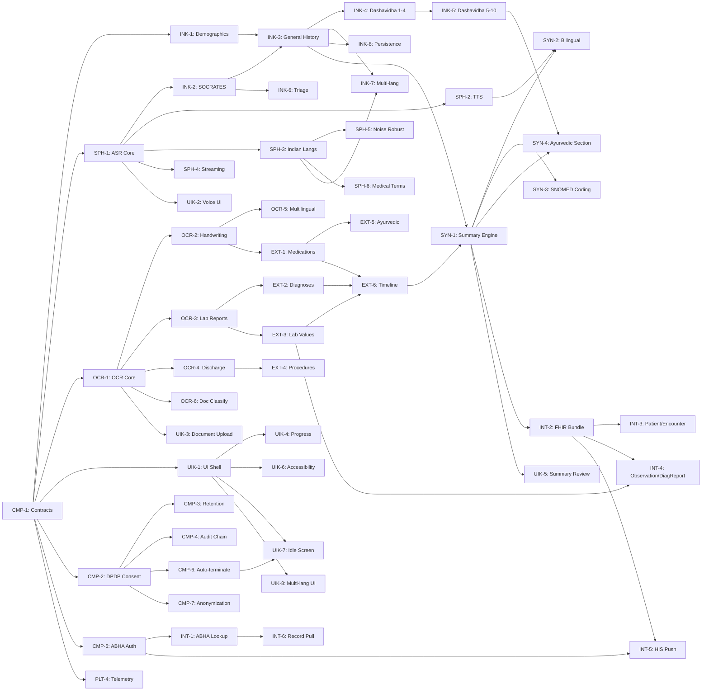

# Roadmap

## The goal

An AI-powered, self-service patient clinical intake kiosk that a patient at AIIA (All India
Institute of Ayurveda) or any Ayush hospital walks up to, speaks to in their language, scans
their existing documents into, and walks away from — leaving behind a structured, bilingual,
physician-ready clinical history, a digitised medical record timeline, and a FHIR-compliant
OPConsultation bundle pushed to the hospital's HIS via ABDM.

The system eliminates the OPD bottleneck where one physician spends 15–20 minutes taking history
manually, replacing it with a 5–8 minute self-service intake that produces a more complete record.

## Where we start

- No existing codebase. Clean start with the methodology scaffold.
- PS 26047 specification from Ministry of Ayush / All India Institute of Ayurveda.
- Open-source ASR models (Whisper, IndicASR) available but not integrated.
- Open-source OCR engines (Tesseract, EasyOCR, PaddleOCR) available but not integrated.
- FHIR R4 specification published; ABDM sandbox available.
- No kiosk hardware yet — develop against a standard touchscreen + camera + microphone setup.
- No clinical validation yet — synthetic data only until physician review.

## What PS 26047 requires and which tasks build it

| The problem statement says | Tasks | Proven by |
|---|---|---|
| AI-powered patient case-taking software | INK-1 through INK-8 | EVL-11 clinical scenario tests |
| Voice-based interaction in Indian languages | SPH-1 through SPH-6 | EVL-8 ASR WER per language |
| Touch-based fallback UI | UIK-1 through UIK-8 | EVL-8 usability metrics |
| SOCRATES clinical questioning | INK-2, INK-3 | EVL-5 clinical completeness score |
| Ayurvedic Dashavidha Pariksha | INK-4, INK-5 | EVL-5 Ayurvedic assessment coverage |
| Red-flag emergency triage | INK-6 | EVL-10 triage sensitivity and specificity |
| Document digitization (prescriptions, labs, discharge summaries) | OCR-1 through OCR-6 | EVL-6 OCR accuracy |
| Entity extraction (medications, diagnoses, lab values) | EXT-1 through EXT-5 | EVL-7 entity F1 |
| Chronological clinical timeline | EXT-6 | EVL-7 timeline ordering accuracy |
| Bilingual clinical summary (Hindi + English) | SYN-1 through SYN-4 | EVL-9 physician acceptance rate |
| DPDP Act 2023 compliance | CMP-1 through CMP-7 | EVL-12 compliance audit |
| ABHA ID authentication | CMP-5, INT-1 | EVL-12 ABDM interop test |
| FHIR OPConsultation bundle | INT-2 through INT-4 | EVL-12 FHIR validation |
| HIS/EMR integration via ABDM | INT-5, INT-6 | EVL-12 integration test |
| Self-service kiosk operation | PLT-3, UIK-1, UIK-7 | EVL-11 end-to-end kiosk flow |

## The rubric

| # | Criterion | Weight | Measured by |
|---|---|---|---|
| 1 | Clinical completeness and accuracy | 25% | SOCRATES coverage, Dashavidha completeness, red-flag sensitivity, HPI depth |
| 2 | Document intelligence accuracy | 20% | OCR character accuracy, entity extraction F1, timeline correctness, code mapping |
| 3 | Summary quality | 20% | Physician acceptance rate, bilingual accuracy, SNOMED coding, section completeness |
| 4 | System performance | 20% | ASR latency, OCR throughput, end-to-end intake time, kiosk resource usage |
| 5 | Compliance and integration | 15% | DPDP consent compliance, FHIR validation pass rate, ABDM interop, ABHA auth |

## Phases and gates

### P0 — Foundation

The system compiles, the contract types are frozen, the development environment works, and
the baseline is measured.

1. CMP-1: all 12 contract types in `core/contracts/` are defined and frozen.
2. PLT-1: `bash scripts/setup.sh` gets a clean clone to a green `pytest`.
3. PLT-2: core module split and build pipeline working.
4. SPH-1: core ASR pipeline runs on a single language.
5. OCR-1: core OCR pipeline runs on printed text.
6. UIK-1: patient-facing touch UI shell renders with language selection.
7. EVL-1: baseline v0 measurement recorded.

**Gate:** every P0 task is done, `pytest` and `mypy` pass, and the contract types are
reviewed by the full team.

### P1 — Core Capabilities

The four modules work end-to-end: a patient can speak, scan documents, receive a summary,
and the system produces a FHIR bundle.

1. INK-2, INK-3: SOCRATES and general history-taking work.
2. INK-4, INK-5: Dashavidha Pariksha assessment works.
3. INK-6: red-flag triage fires alerts.
4. SPH-2, SPH-3, SPH-4: TTS, Indian languages, and streaming ASR work.
5. OCR-2, OCR-3, OCR-4, OCR-6: handwriting, lab reports, discharge summaries, and doc classification.
6. EXT-1 through EXT-4, EXT-6: entity extraction and timeline.
7. SYN-1, SYN-2: summary engine and bilingual output.
8. CMP-2, CMP-4, CMP-5: DPDP consent, audit chain, ABHA auth.
9. INT-1 through INT-4: ABHA lookup, FHIR bundle, Patient/Encounter/Observation.
10. UIK-2, UIK-3, UIK-4: voice intake UI, document upload, progress indicator.
11. PLT-4, PLT-6: telemetry and CI/CD.
12. EVL-2 through EVL-13: all benchmarks and the ratchet.

**Gate:** end-to-end demo on synthetic data. A patient scenario runs voice intake → document
scan → entity extraction → summary → FHIR bundle, with all metrics above baseline.

### P2 — Integration and Hardening

Edge cases, multilingual expansion, ABDM push, offline mode, accessibility.

1. INK-7, INK-8: multi-language intake, session persistence.
2. SPH-5, SPH-6: noise-robust ASR, medical terminology fine-tuning.
3. OCR-5: multilingual OCR.
4. EXT-5: Ayurvedic formulation recognition.
5. SYN-3, SYN-4: editable summary with SNOMED coding, Ayurvedic section.
6. CMP-3, CMP-6, CMP-7: retention policy, auto-termination, anonymization.
7. INT-5, INT-6: HIS push, health record pull.
8. PLT-5, PLT-7: offline-first, Docker containerization.
9. UIK-5 through UIK-8: physician review, accessibility, idle screen, multi-language UI.
10. EVL-14: rubric report.

**Gate:** ABDM sandbox integration test passes. Offline demo works. Accessibility audit passes.

### P3 — Demo-Ready

Packaging, rehearsal, deployment to venue hardware.

1. PLT-8: kiosk provisioning and fleet management.
2. Full rehearsal with synthetic patients on venue hardware.
3. Offline deployment package with all models bundled.
4. Demo script with 3 clinical scenarios (modern medicine + Ayurvedic + emergency triage).

**Gate:** the demo runs without internet on venue hardware, and the rubric report covers
all five criteria.

## Areas

| Area | Tag | Task file | Reviewer | Tracks |
|---|---|---|---|---|
| Clinical Intake | INK | `docs/tasks/INTAKE.md` | Agent-A | core/intake/, kiosk/ui/ |
| Speech Pipeline | SPH | `docs/tasks/SPEECH.md` | Agent-B | kiosk/speech/ |
| Document OCR | OCR | `docs/tasks/OCR.md` | Agent-C | kiosk/ocr/, kiosk/camera/ |
| Entity Extraction | EXT | `docs/tasks/EXTRACTION.md` | Agent-A | core/extraction/, core/timeline/ |
| Clinical Synthesis | SYN | `docs/tasks/SYNTHESIS.md` | Agent-D | core/synthesis/, server/inference/ |
| Compliance & Consent | CMP | `docs/tasks/COMPLIANCE.md` | Agent-E | core/consent/, core/contracts/ |
| FHIR & Integration | INT | `docs/tasks/INTEGRATION.md` | Agent-D | core/fhir/, server/abdm/ |
| Platform & Kiosk | PLT | `docs/tasks/PLATFORM.md` | Agent-F | scripts/, server/deploy/ |
| Evaluation | EVL | `docs/tasks/EVALUATION.md` | Agent-C | eval/ |
| Kiosk UI/UX | UIK | `docs/tasks/KIOSK_UI.md` | Agent-B | kiosk/ui/, kiosk/session/ |

## The dependencies that shape the order

## What does not change

- **core/ stays pure.** No I/O, no network, no hardware imports. Enforced by CI.
- **Consent before any data egress.** The consent chokepoint is architectural, not procedural.
- **FHIR R4 for all clinical data exchange.** No custom wire formats cross the ABDM boundary.
- **Contracts frozen between phase gates.** Widening needs an ADR.
- **One owner per task.** Two agents on the same file means one reviews the other.
- **eval/ measures everything.** A criterion without a metric has not been addressed.
- **Bilingual parity.** Patient-facing output always has both Hindi and English.
- **No PHI in logs.** Ever.
