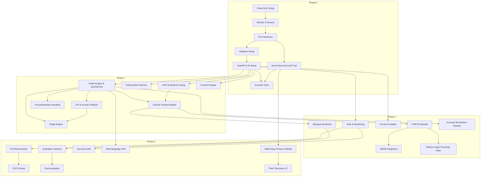

# MediKiosk Production Roadmap

This roadmap outlines the path to production for the MediKiosk platform across 4 key phases.

## Phase 0: Foundation (Week 1-2) — Architecture Migration

**Goal**: Move from hackathon monolith to a robust clean architecture.

- Migrate from hackathon monolith to clean architecture
- Define domain contracts (all 14+ Pydantic models, including enterprise fields)
- Define port interfaces (LLM, database, storage, cache, ABDM, audit, presence, telemetry)
- Implement adapter implementations (Gemini, SQLAlchemy, local storage)
- Write invariant tests (purity, imports, chokepoint, audit trail immutability)
- Set up database schema + Alembic migrations
- Build new FastAPI app with dependency injection
- **Event-sourced audit trail** — append-only events table with database-level UPDATE/DELETE protection, `AuditEventType` enum, `adapters/database/audit_repo.py` implementing `ports/audit.py`
- **CI/CD security pipeline** — GitHub Actions workflow with 7 gates: lint, type check, invariant tests, unit tests, security scan (pip-audit + bandit + gitleaks), PHI leak detection, container image scan (trivy). No PR merges without all gates passing.
- **Three-layer AI SDLC** — establish the Write → Review → CI pipeline per `docs/AI_ORCHESTRATION.md`. Writing agent prompt templates, review agent checklists, and CI gatekeeper all operational before any domain code is written.
- **Gate**: All invariant tests pass, domain tests pass, API serves requests, audit events are append-only verified, CI pipeline runs end-to-end.

## Phase 1: Core Engine (Week 3-4) — Domain Logic

**Goal**: Implement the core clinical intake intelligence.

- Intake engine with full SOCRATES protocol implementation
- Dashavidha Pariksha (Ayurvedic assessment) integration
- OCR pipeline with entity extraction + medical coding (SNOMED/ICD/LOINC)
- Clinical timeline builder
- Triage engine with red-flag detection
- Consent engine with DPDP audit chain
- **Proxy/Attendant handling** — intake engine must ask "Who is providing this history?" at session start and record `informant_type` + `informant_relationship` in the `SessionState`. Downstream summary must note proxy attribution.
- **Conversation Frustration Index (CFI)** — intake engine increments `frustration_index` on low ASR confidence, repeated questions, long pauses, and explicit confusion. When CFI ≥ threshold, `human_fallback_triggered = True` and no further AI questions are generated. Service layer routes the patient to a staff desk.
- **Gate**: Clinical completeness ≥ 70%, OCR F1 ≥ 65%, CFI-triggered fallback fires correctly in test scenarios.

## Phase 2: Synthesis & Integration (Week 5-6)

**Goal**: Finalize system integration and data export capabilities.

- Bilingual summary synthesis engine
- FHIR R4 bundle generation with validation
- ABDM integration (mock → real gateway)
- Frontend update for new API integration
- Authentication & authorization setup
- Rate limiting, logging, monitoring setup
- **Acoustic biomarkers pipeline** — `VoiceCapture` adapter computes `speech_rate_wpm`, `cough_events_detected`, and `max_pause_duration_seconds` from each audio segment. These telemetry fields feed into the triage engine (e.g., persistent cough → respiratory flag, bradyphrenia → neurological flag).
- **Medico-legal transcript hash** — `FHIRBundle` builder computes `source_transcript_hash` (SHA-256 of all concatenated source transcripts + OCR text) and embeds it in the bundle. This creates a cryptographic chain from raw patient input to FHIR output.
- **Gate**: End-to-end workflow passes, FHIR validation 100%, `source_transcript_hash` verified in bundle, acoustic biomarkers populate in test scenarios.

## Phase 3: Production Hardening (Week 7-8)

**Goal**: Prepare for real-world kiosk deployment and fleet scale.

- Evaluation harness with synthetic patient corpora
- Performance benchmarks and optimization
- Security audit
- Multi-language ASR integration (server-side Whisper)
- Deployment pipeline (CI/CD)
- Documentation completion
- **Walk-away privacy failsafe** — edge-vision presence detector (USB webcam / IR proximity sensor) triggers DPDP Ephemeral Purge after 15 seconds of no presence. Implements `ports/presence.py` with hardware and timer-based adapters. Frontend subscribes to `ws://localhost:9090/presence` for "Are you still there?" countdown.
- **Fleet telemetry (IoT)** — parallel health heartbeat (printer status, mic health, disk space, network latency, camera status) via `ports/telemetry.py` + `adapters/hardware/fleet_telemetry.py`. Fire-and-forget channel, zero PHI, null adapter in dev/browser mode.
- **Zero-Trust kiosk hardening** — TPM-sealed disk encryption, secure boot chain, USB port lockdown, mTLS between kiosk and API gateway, read-only root filesystem. Per `docs/SECURITY.md` §2 and `docs/decisions/0002-zero-trust-edge-security.md`.
- **Penetration testing** — full threat model validation against `docs/SECURITY.md` §1. OWASP Top 10, LLM prompt injection, kiosk physical attack surface, ABDM integration security.
- **Gate**: All success metrics from VISION.md met, walk-away purge verified on kiosk hardware, fleet telemetry dashboard receiving heartbeats, zero HIGH/CRITICAL findings in pen test.

## Dependency DAG

```mermaid
flowchart TD
    subgraph Phase 0
        P0_1["Clean Arch Setup"] --> P0_2["Domain Contracts"]
        P0_2 --> P0_3["Port Interfaces"]
        P0_3 --> P0_4["Adapters Setup"]
        P0_4 --> P0_5["FastAPI & DI Setup"]
        P0_5 --> P0_6["Invariant Tests"]
        P0_3 --> P0_7["Event-Sourced Audit Trail"]
        P0_7 --> P0_6
    end

    subgraph Phase 1
        P0_5 --> P1_1["Intake Engine & SOCRATES"]
        P0_5 --> P1_2["Dashavidha Pariksha"]
        P0_5 --> P1_3["OCR & Medical Coding"]
        P1_1 --> P1_4["Clinical Timeline Builder"]
        P1_3 --> P1_4
        P1_1 --> P1_5["Triage Engine"]
        P0_5 --> P1_6["Consent Engine"]
        P1_1 --> P1_7["Proxy/Attendant Handling"]
        P1_1 --> P1_8["CFI & Human Fallback"]
        P1_8 --> P1_5
    end

    subgraph Phase 2
        P1_4 --> P2_1["Bilingual Synthesis"]
        P1_4 --> P2_2["FHIR R4 Bundle"]
        P2_2 --> P2_3["ABDM Integration"]
        P0_5 --> P2_4["Frontend Update"]
        P0_5 --> P2_5["Auth & Monitoring"]
        P2_2 --> P2_6["Medico-Legal Transcript Hash"]
        P1_1 --> P2_7["Acoustic Biomarkers Pipeline"]
        %% P2_7 enriches P1_5 (Triage Engine) but is not a blocking dependency
    end

    subgraph Phase 3
        P2_1 --> P3_1["Evaluation Harness"]
        P2_5 --> P3_2["Perf Benchmarks"]
        P2_5 --> P3_3["Security Audit"]
        P1_1 --> P3_4["Multi-language ASR"]
        P3_2 --> P3_5["CI/CD Setup"]
        P3_1 --> P3_6["Documentation"]
        P0_7 --> P3_7["Walk-Away Privacy Failsafe"]
        P3_7 --> P3_8["Fleet Telemetry IoT"]
    end
```

## Task Domain Mapping

| Task Domain | Task Name | Phase |
|---|---|---|
| Architecture | Clean Architecture Migration | 0 |
| Domain | Domain Contracts & Interfaces | 0 |
| Infrastructure | Adapters & Database Schema | 0 |
| **Audit** | **Event-Sourced Medico-Legal Audit Trail** | **0** |
| Clinical Logic | Intake Engine (SOCRATES, Dashavidha) | 1 |
| Document Processing | OCR & Entity Extraction | 1 |
| Clinical Logic | Clinical Timeline & Triage | 1 |
| Privacy | Consent Engine | 1 |
| **Clinical Logic** | **Proxy/Attendant Handling** | **1** |
| **Resilience** | **Conversation Frustration Index & Human Fallback** | **1** |
| Synthesis | Bilingual Summary & FHIR | 2 |
| Integration | ABDM & Frontend Update | 2 |
| DevOps | Auth, Rate Limiting, CI/CD | 2, 3 |
| **AI / Signal** | **Acoustic Biomarkers Pipeline** | **2** |
| **Compliance** | **Medico-Legal Transcript Hash** | **2** |
| AI / ML | Evaluation Harness, ASR | 3 |
| Quality | Performance, Security, Docs | 3 |
| **Hardware** | **Walk-Away Privacy Failsafe** | **3** |
| **Operations** | **Fleet Telemetry (IoT)** | **3** |
| **Security** | **CI/CD Security Pipeline (7 gates)** | **0** |
| **Process** | **Three-Layer AI SDLC (Write→Review→CI)** | **0** |
| **Security** | **Zero-Trust Kiosk Hardening (TPM, mTLS, USB lockdown)** | **3** |
| **Security** | **Penetration Testing & Threat Validation** | **3** |

---

## Phase X: Hospital Front-Door OS (From Architecture Backlog)

> **Vision:** Transform MediKiosk from an acute triage engine into a full-scale
> **Hospital Front-Door Operating System** — benchmarked against Narayana Health,
> Apollo 24|7, Manipal Hospitals, and Max Healthcare.
>
> **When to start:** After Phase 3 is production-stable. Full specifications for
> every item — including exact contract fields, port signatures, adapter paths,
> and AuditEvent types — are in [`docs/ARCHITECTURE_BACKLOG.md`](ARCHITECTURE_BACKLOG.md).

### P0 — Must-Have for Hospital Launch

#### X.12 — Medical Safety Guardrail *(INVARIANT)*
Deterministic Veto Engine bypass: if `TriagePriority.CRITICAL`, ALL commercial flows
(doctor selection, packages, billing, queue) are skipped. Direct ER alarm + wheelchair
dispatch. Enforced by invariant test. **No new contracts — uses existing triage + billing types.**

#### X.6 — Doctor Discovery & Transparent Pricing *(Narayana Health)*
Searchable doctor directory filtered by department, language, seniority. Shows degrees,
experience, ratings, transparent fee breakdown, PM-JAY badges, chamber room, live
availability status. Follow-up eligibility auto-detected via phone/UHID lookup.
- New contract: `DoctorProfile`, `DoctorSeniorityTier`, `DoctorAvailabilityStatus`
- New port: `ports/doctor.py` (`DoctorRepository`)
- API: `GET /api/doctors`, `POST /api/intake/select-doctor`

#### X.8 — Touchless Kiosk Payments (BharatQR / UPI)
Dynamic 3-minute UPI QR code for exact fee. Webhook verification. Cash counter fallback
with barcode slip. Emergency patients bypass all billing.
- New contracts: `ConsultationBill`, `PaymentTransaction`, `PaymentStatus`, `BillingType`
- New port: `ports/payment.py` (`PaymentGatewayPort`)
- Adapters: Razorpay, mock

### P1 — High Priority

#### X.4 — PM-JAY / Insurance Eligibility *(Manipal/Max)*
Instant PM-JAY Golden Card verification via NHA API. Cashless tagging. TPA insurance
card OCR via existing OCRService.
- New contracts: `BillingEligibility`, `InsuranceScheme`, `EligibilityStatus`
- New port: `ports/insurance.py` (`InsurancePort`)

#### X.9 — Queue Tokens with Acuity Weighting *(Apollo Qwaiting)*
Structured tokens: `CARD-E-01` (Emergency), `CARD-R-14` (Routine). Acuity-based
re-sorting. Integrates with signage (X.2) and WhatsApp (X.1).
- New contract: `QueueToken`, `TokenPriority`
- Updated port: `ports/queue.py` → `QueueOrchestratorPort`

#### X.1 — Virtual Waiting Room & WhatsApp/SMS Routing *(Waitwhile)*
ML-predictive wait times, T-10 / T-2 alerts via WhatsApp/SMS. QR-based lobby exit.
- New contracts: `QueueEntry`, `WaitTimeUpdate`, `WaitingRoomStatus`
- New ports: `ports/communications.py`, `ports/queue.py`

#### X.7 — Preventive Health Packages *(Apollo 24|7)*
Symptom-triggered health package suggestions (Cardiac, Ayush, Senior, Fever panels).
Cross-sell diagnostics at intake. PM-JAY coverage badges.
- New contracts: `HospitalPackage`, `PackageCategory`
- New port: `ports/package.py` (`PackageCatalogPort`)
- API: `GET /api/packages`, `POST /api/intake/select-package`

### P2 — Medium Priority

#### X.2 — Digital Signage & Lobby Display
WebSocket-driven TV token board. No PHI by contract design.
- New contract: `DisplayEvent`, `DisplayEventType`
- New port: `ports/display.py` (`DisplayBroadcaster`)

#### X.5 — Admin Analytics Dashboard *(OPDX)*
Heatmap/KPI board derived from append-only AuditEvent log. Admin-role-gated API.
- New contract: `AnalyticsSnapshot`, `MetricPeriod`
- New port: `ports/analytics.py` (`AnalyticsPort`)

#### X.10 — Indoor Wayfinding & Navigation
Interactive 2D floor maps. SMS/WhatsApp turn-by-turn directions. Thermal slip with QR.
- New contract: `WayfindingRoute`
- New port: `ports/wayfinding.py` (`WayfindingPort`)

#### X.11 — ABHA 1-Click Scan-and-Share *(Manipal/Max)*
QR code scan with Aarogya Setu / ABHA app auto-fills demographics without typing.
- Extends existing `ABDMGateway` port with `generate_abha_scan_qr()`, `receive_abha_callback()`
- New `ConsentPurpose.ABHA_IDENTITY_SHARE`

### P3 — Later

#### X.3 — Telehealth Smart Diversion *(Mediktor)*
ESI Level 5 patients offered video consultation or pharmacy refill.
- New contract: `TelehealthSession`, `DiversionType`
- New port: `ports/telehealth.py` (`TelehealthPort`)

---

### Phase X — Complete Port & Contract Summary

| Port file | Protocol | Features |
|---|---|---|
| `ports/doctor.py` | `DoctorRepository` | X.6 |
| `ports/package.py` | `PackageCatalogPort` | X.7 |
| `ports/payment.py` | `PaymentGatewayPort` | X.8 |
| `ports/queue.py` | `QueueOrchestratorPort` | X.1, X.9 |
| `ports/communications.py` | `CommunicationsPort` | X.1 |
| `ports/display.py` | `DisplayBroadcaster` | X.2 |
| `ports/telehealth.py` | `TelehealthPort` | X.3 |
| `ports/insurance.py` | `InsurancePort` | X.4 |
| `ports/analytics.py` | `AnalyticsPort` | X.5 |
| `ports/wayfinding.py` | `WayfindingPort` | X.10 |

| Contract file | New types | Features |
|---|---|---|
| `contracts/doctor.py` | `DoctorProfile`, `DoctorSeniorityTier`, `DoctorAvailabilityStatus` | X.6 |
| `contracts/package.py` | `HospitalPackage`, `PackageCategory` | X.7 |
| `contracts/billing.py` | `BillingEligibility`, `ConsultationBill`, `PaymentTransaction`, enums | X.4, X.8 |
| `contracts/queue.py` | `QueueToken`, `QueueEntry`, `WaitTimeUpdate`, `TokenPriority`, `WaitingRoomStatus` | X.1, X.9 |
| `contracts/display.py` | `DisplayEvent`, `DisplayEventType` | X.2 |
| `contracts/telehealth.py` | `TelehealthSession`, `DiversionType` | X.3 |
| `contracts/analytics.py` | `AnalyticsSnapshot`, `MetricPeriod` | X.5 |
| `contracts/wayfinding.py` | `WayfindingRoute` | X.10 |

> **For AI agents:** Read `docs/ARCHITECTURE_BACKLOG.md` in full before implementing
> ANY Phase X item. It contains exact field names, types, enum values, security
> constraints, and the emergency guardrail invariant.
